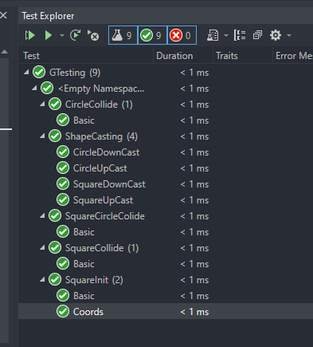

Incase VS Studio throws a fit when you run this without the .vs folder (I performed some properties configuration to make it run)

## Known Quirks

- Tests can only be run in Debug x86 mode
- Source.cpp (game) can only be run in Release x86 mode

I think this is due to some quirk with GTest, or how I have configured it, despite the fact that after looking into it I have setup GTesting in the correct way for VS

## Testing Output

```
Group Name: GTesting
Duration: 0:00:00
0 test(s) failed
0 test(s) skipped
9 test(s) passed
```



## Game Output

### Source.cpp game settings

```cpp
int main() {
Game g = Game(3, 3, 2, 15);
g.play();
}
```

### Game Console Output

```
===> Game Contents <===
0: [SQUARE] (6, 1) length=2
1: [SQUARE] (4, 14) length=1
2: [SQUARE] (7, 3) length=1
3: [CIRCLE] (6, 8) radius=1
4: [CIRCLE] (3, 5) radius=2
5: [CIRCLE] (4, 9) radius=2

[1] Running... 6 left
===> Game Contents <===
0: [SQUARE] (6, 0) length=2
1: [SQUARE] (3, 14) length=1
2: [SQUARE] (7, 4) length=1
3: [CIRCLE] (6, 8) radius=1
4: [CIRCLE] (2, 4) radius=2
5: [CIRCLE] (5, 7) radius=2
==> Purging Collisions <==
[3] + [5] Collides <- Removed!
[5] + [3] Collides <- Removed!

[2] Running... 4 left
===> Game Contents <===
0: [SQUARE] (6, 0) length=2
1: [SQUARE] (2, 14) length=1
2: [SQUARE] (9, 4) length=1
3: [CIRCLE] (2, 8) radius=2
==> Purging Collisions <==

[3] Running... 4 left
===> Game Contents <===
0: [SQUARE] (6, 1) length=2
1: [SQUARE] (3, 14) length=1
2: [SQUARE] (8, 3) length=1
3: [CIRCLE] (3, 11) radius=2
==> Purging Collisions <==
[0] + [2] Collides <- Removed!
[2] + [0] Collides <- Removed!

[4] Running... 2 left
===> Game Contents <===
0: [SQUARE] (3, 14) length=1
1: [CIRCLE] (3, 9) radius=2
==> Purging Collisions <==

[5] Running... 2 left
===> Game Contents <===
0: [SQUARE] (1, 14) length=1
1: [CIRCLE] (2, 8) radius=2
==> Purging Collisions <==

[6] Running... 2 left
===> Game Contents <===
0: [SQUARE] (2, 14) length=1
1: [CIRCLE] (4, 8) radius=2
==> Purging Collisions <==

[7] Running... 2 left
===> Game Contents <===
0: [SQUARE] (4, 14) length=1
1: [CIRCLE] (6, 9) radius=2
==> Purging Collisions <==

[8] Running... 2 left
===> Game Contents <===
0: [SQUARE] (6, 14) length=1
1: [CIRCLE] (8, 3) radius=2
==> Purging Collisions <==

[9] Running... 2 left
===> Game Contents <===
0: [SQUARE] (4, 14) length=1
1: [CIRCLE] (6, 2) radius=2
==> Purging Collisions <==

[10] Running... 2 left
===> Game Contents <===
0: [SQUARE] (2, 14) length=1
1: [CIRCLE] (2, 2) radius=2
==> Purging Collisions <==

[11] Running... 2 left
===> Game Contents <===
0: [SQUARE] (2, 14) length=1
1: [CIRCLE] (4, 6) radius=2
==> Purging Collisions <==

[12] Running... 2 left
===> Game Contents <===
0: [SQUARE] (2, 13) length=1
1: [CIRCLE] (2, 2) radius=2
==> Purging Collisions <==

[13] Running... 2 left
===> Game Contents <===
0: [SQUARE] (4, 13) length=1
1: [CIRCLE] (2, 2) radius=2
==> Purging Collisions <==

[14] Running... 2 left
===> Game Contents <===
0: [SQUARE] (3, 12) length=1
1: [CIRCLE] (4, 10) radius=2
==> Purging Collisions <==
[0] + [1] Collides <- Removed!
[1] + [0] Collides <- Removed!
```

## Game Output 2

```cpp
int main() {
	Game g = Game(3, 3, 2, 10);
	g.play();
}
```

```
===> Game Contents <===
0: [SQUARE] (7, 7) length=2
1: [SQUARE] (3, 9) length=1
2: [SQUARE] (2, 9) length=1
3: [CIRCLE] (3, 9) radius=1
4: [CIRCLE] (2, 7) radius=2
5: [CIRCLE] (3, 6) radius=2
==> Purging Collisions <==
[1] + [2] Collides <- Removed!
[1] + [3] Collides <- Removed!
[2] + [1] Collides <- Removed!
[2] + [3] Collides <- Removed!
[2] + [4] Collides <- Removed!
[3] + [1] Collides <- Removed!
[3] + [2] Collides <- Removed!
[3] + [4] Collides <- Removed!
[3] + [5] Collides <- Removed!
[4] + [2] Collides <- Removed!
[4] + [3] Collides <- Removed!
[4] + [5] Collides <- Removed!
[5] + [3] Collides <- Removed!
[5] + [4] Collides <- Removed!

```
